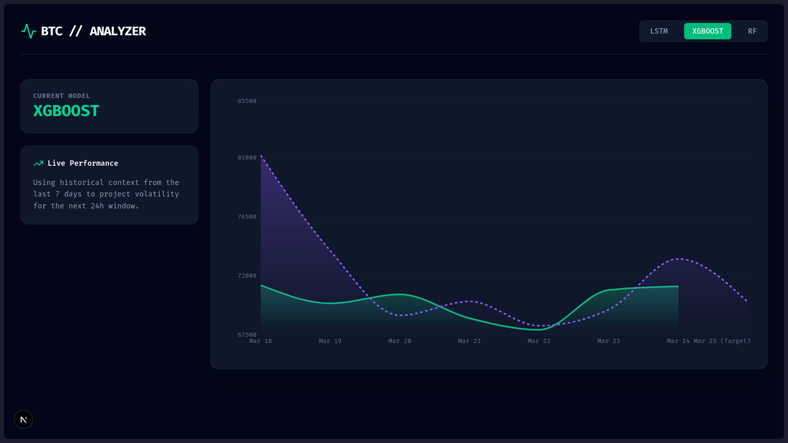

# Bitcoin Analyzer 📈

Bitcoin Analyzer is a full-stack data analytics and machine learning application designed to analyze Bitcoin market trends, predict price movements, and visualize cryptocurrency data.

## 🏗️ Project Structure

This repository is split into three main components to ensure a clean separation of concerns:

- **`/ml-engine`** (FastAPI,Jupyter Notebook) 🧠
  Contains the core machine learning models, data exploration, and feature engineering scripts used to analyze Bitcoin historical data and predict trends.
- **`/backend-engine`** (Springboot(Java)) ⚙️
  The backend API layer responsible for serving data, interacting with databases, handling business logic, and exposing the machine learning model results to the web client.
- **`/frontend`** (Nextjs) 💻
  The user-facing web application that visualizes the Bitcoin data, charts, and predictive analysis through an interactive dashboard.

## 🚀 Features

- **Real-time Data Integration**: Fetches Bitcoin OHLCV data from public APIs
- **Advanced Feature Engineering**: 15+ technical indicators derived from price/volume
- **Deep Learning Models**: LSTM (GRU variants) and Transformer-based architectures
- **Ensemble Predictions**: Combines multiple models for robust forecasting
- **Low-Latency API**: Sub-100ms inference via Spring Boot REST endpoints
- **Model Versioning**: Automatic tracking of model performance and weights
- **Interactive Dashboard**: Real-time predictions and backtesting visualization

## 🛠️ Tech Stack

### ML Engine

- **Python 3.10+**
- **TensorFlow/Keras** - Deep learning models
- **Pandas/NumPy** - Data processing
- **Scikit-learn** - Feature scaling, evaluation metrics
- **Jupyter Notebook** - Experimentation & analysis

### Backend

- **Spring Boot 3.x** - REST API framework
- **Maven** - Dependency management

### Frontend

- **NextJS** - UI framework
- **Tailwind** - CSS
