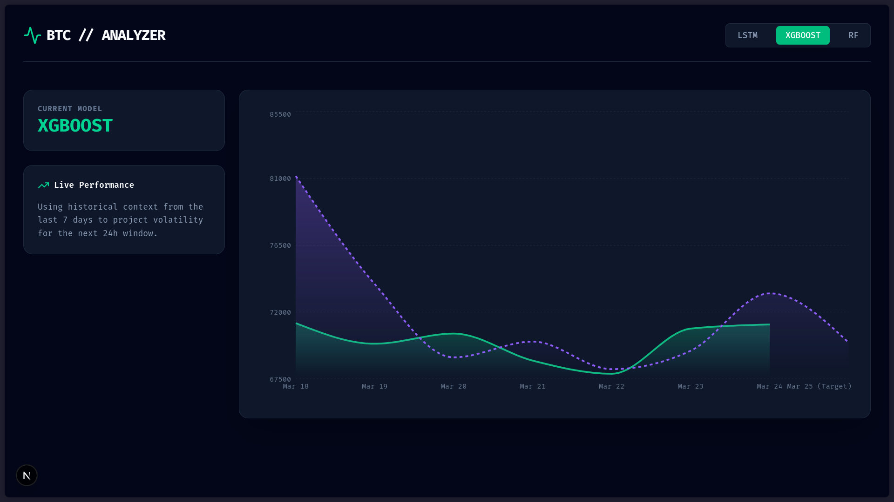
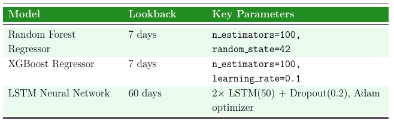

# Bitcoin Analyzer 📈

Bitcoin Analyzer is a full-stack data analytics and machine learning application designed to analyze Bitcoin market trends, serving primarily as an experimental sandbox. Rather than claiming to definitively predict price movements, this project explores the limitations of forecasting cryptocurrency markets. Due to extreme volatility, sudden macroeconomic shifts, regulatory news, and whale movements, crypto assets often behave unpredictably, demonstrating why past performance and historical data are inherently unreliable indicators of future results.

## Project Structure

This repository is split into three main components to ensure a clean separation of concerns:

- **`/ml-engine`** (FastAPI, Jupyter Notebook) 
  Contains the core machine learning models, data exploration, and feature engineering scripts used to analyze Bitcoin historical data and predict trends.
- **`/backend-engine`** (Go, Gin Framework) 
  The backend API layer responsible for orchestrating the ML engine, handling HTTP requests, and exposing prediction results to the web client with low-latency performance.
- **`/frontend`** (Next.js) 
  The user-facing web application that visualizes the Bitcoin data, charts, and predictive analysis through an interactive dashboard.

## 🚀 Features

- **Real-time Data Integration**: Fetches Bitcoin OHLCV data from public APIs
- **Advanced Feature Engineering**: 15+ technical indicators derived from price/volume
- **Deep Learning Models**: LSTM (GRU variants) and Transformer-based architectures
- **Ensemble Predictions**: Combines multiple models for robust forecasting
- **Low-Latency API**: Sub-100ms inference via Go REST endpoints with efficient goroutine handling
- **Model Versioning**: Automatic tracking of model performance and weights
- **Interactive Dashboard**: Real-time predictions and visualization

## 🛠️ Tech Stack

### ML Engine

- **Python 3.10+**
- **TensorFlow/Keras** - Deep learning models
- **Pandas/NumPy** - Data processing
- **Scikit-learn** - Feature scaling, evaluation metrics
- **FastAPI** - High-performance Python API server
- **Jupyter Notebook** - Experimentation & analysis

### Backend

- **Go 1.21+** - High-performance language
- **Gin Framework** - Lightweight HTTP web framework
- **CORS Support** - Cross-origin resource sharing for frontend communication

### Frontend

- **Next.js 14+** - React framework
- **Tailwind CSS** - Utility-first styling
- **Recharts** - Interactive charting library

## 🚀 Getting Started

### Prerequisites

- Go 1.21 or higher
- Python 3.10+
- Node.js 18+
- pip (Python package manager)
- npm or yarn (Node package manager)

